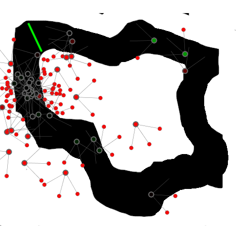
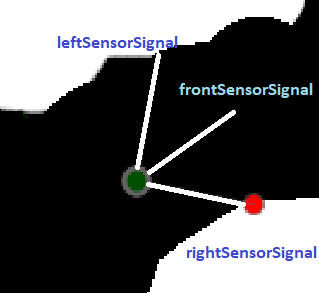
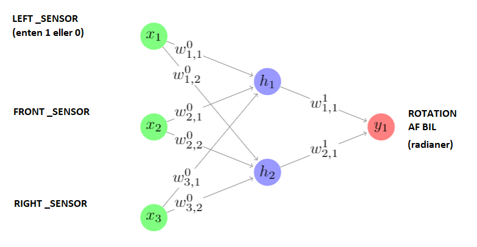
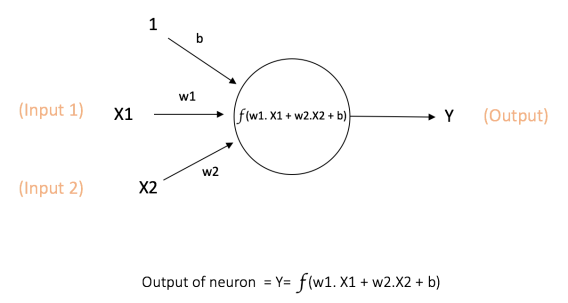
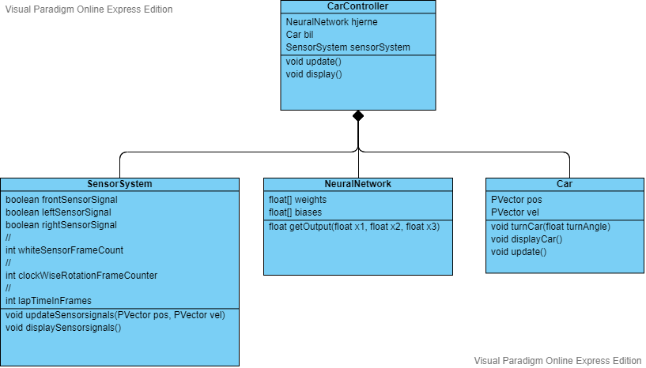

# Racerbils Neuro Evolution
Dette repo indeholder kode og materiale til forløbet "Racerbils Evolution".  
Formålet med forløbet er at bygge en genetisk algoritme, der kan udvikle den hurtigst mulige racerbil.   
Dvs. den bil, der kan gennemføre en omgang på den virtuelle 2D-racerbane hurtigst muligt uden at køre galt. 
Racerbilerne styres af et såkaldt neuralt netværk.

## Bekrivelse af programmet 
### Racerbils Evolutions Programmet
Mappen "RacerBilsEvolutionsProgram" indeholder et program til at generere "tilfældige", simple autonome racerbiler i en 2D verden. 
Med tilfældige menes, at deres hjerner - et simpelt neuralt netværk - endnu ikke er indstillet/optimeret, da dette skal gøres med en genetisk algoritme. 
De autonome bilers sensorsystem kan genkende to forskellige farver: "hvid", som er udenfor banen, og "grøn", som er målstregen.
Genkendelse af farven grøn kan bruges til at beregne, hvor hurtigt bilen gennemfører en omgang. 
Bilerne bevæger sig med en konstant hastighed på 5 pixels pr. frame, og de ændrer retning ved at rotere om egen akse. Nedenfor ses et screenshot af programmet: 

### Racerbilens grafiske visning
Nedenfor ses en racerbil, som den ser ud i programmet. Den højre sensor har detekteret den hvide farve og lyser rødt:

## Beksrivelse af bilens hjerne: Det neurale netværk
Bilernes hjerner styrer bilen ved at reagere på input fra de sensorer, der registerer farven "hvid", da alt udenfor banen er hvidt.
Hjernen fortæller baseret på sine input, om bilen skal rotere til venstre eller højre.
Hjernen er et simpelt fuldt forbundet feedforward neuralt netværk. Nedenfor ses et diagram over bilens neurale netværk: 

Et neuralt netværk er opbygget af neuroner (vist med cirkler), som modtager et vilkårligt antal input, som hver bliver multipliceret med et tal kaldet en "vægt" (vist som w). Reultatet bliver adderet med et andet tal kaldet "bias" (ikke vist) og sendes igennem en matematisk funktion kaldet en "aktiverings funktion" (ikke vist). Vi arbejder med meget simple neuroner, hvis aktivitetsfunktion bare er f(x) = x eller y = x. 
Man tegner normalt input til hele det neurale netværk, som neuroner markeret med x (de grønne cirkler), selvom de i virkeligheden bare er input. 
Nedenfor ses et eksempel på en neuron: 

Styrken ved det neurale netværk ligger i muligheden for at justere "vægte" og "bias", indtil det giver os det ønskede svar, dvs. styrer bilen uden at køre udenfor banen. 
Blandt andet indenfor billedgenkendelse er væsenligt mere komplicerede neurale netværk populære. Til disse typer opgaver anvendes træningsmetoder kategoriseret som "Deep Learning". 

## Beskrivelse af koden: De vigtigste klasser
### Klassediagram over den autonome racerbil
Nedenfor ses et klassediagram for vigtigste dele af "den autonome racerbil", i koden kaldet "CarController":  

### CarController: Den autonome bil. Indeholder et SensorSystem, et NeuraltNetwork og en Car.
CarControlleren fodrer NeuraltNetwork  med signaler fra SensorSystem’s left/right/front/sensor.  
Det neurale netværks output styrer bilen. 
### Car: Bilen. 
Hastigheden er konstant 5 pixels/frame. Bilen kan kun dreje/rotere enten til venstre eller højre.  
### SensorSystem: Sensorer. Til at styre en bil og udregne fitness. Indeholder følgende vigtige målinger:
**whiteSensorFrameCount:**  Antal frames bilen er i det hvide område uden for banen 
**frontSensorSignal & leftSensorSignal & rightSensorSignal:** Detektion af hvidt, 50 pixels foran bilen. 
**clockWiseRotationFrameCounter:** Antal frames kørt  “i urets retning”. 
**lapTimeInFrames:** Antal frames bilen bruger inden den kører over den grønne streg. 
**amountOfLaps:** Antal runder, som bilerne har kørt rundt i banen. 

### NeuralNetwork: Hjernen. 
Et simpelt netværk: 3 input-, 2 mellem-lags- og 1 output-neuroner. 

# Den genetiske algoritme
## Udregning af laps og tid
"amountOfLaps" og "lapTimeInFrames" bruges for at beregne antal af runder, racerbilerne kører, og hvor lang tid runderne tager i frames. For at beregne "amountOfLaps", kigger vi på de målstregen på banen (den grønne). Vi havde, da vi skrev koden, en idé om at bruge to målstreger med forskellige farver for at sikre, at bilen kører den rigtige vej rundt i banen. Målstregerne skulle så være spredt ud over banen, så det sikres, at en bil ikke kan "snyde" sig til en hurtigere tid ved at finde en kortere vej gennem banen. Vi valgte dog at løse dette problem ved en anden løsning, og derfor er denne kode kommenteret ud. Vi løste problemet ved, at fitness-funktionen vælger de biler, der kører mod uret og dermed den rigtige vej rundt på banen. 

Idéen med den grønne og den blå målstreg var således: Der er en grøn målstreg og en blå målstreg. Vi kan se, at en bil har kørt rundt om banen ved at kigge på, at hvis racerbilen sidst har rørt den grønne, og den så rør den blå målstreg, men ikke rør den grønne og så den grønne igen (da den så vil have kørt over den samme målstreg som før). Vi tager brug af de 2 målstreger, da der opstod et problem med, at racerbilerne blev ved med at køre frem og tilbage over den grønne målstreg. Dette betød, at tallene ikke viste "amountOfLaps" og dermed heller ikke "lapTimeInFrames" ordenligt. 

For at vise "amountOfLaps" og "lapTimeInFrames" for kun den bedste bil (alias bilen med højest fitness) er variablen "bestCar" oprettet og defineret ud fra bilen sorteret til at have den højeste fitness, og derefter er "bestAmountOfLaps" og "bestLapTimeInFrames" defineret ud fra "bestCar", så vi får amountOfLaps og lapTimeInFrames for kun den bil med højest fitness, som vil svare til den hurtigste bil. Det er dermed kun den bedste bil (med højest fitness), som vi viser i selve programmets interface (ikke i konsollen; her vises blot "amountOfLaps" og "lapTimesInFrames" (for alle bilerne)). 

## Fjernelse af biler
I RacerbilsEvolutionsProgram-filen ses det, at vi frasorterer de dårligste biler hver 100. frames. Her frasorterer vi de biler, som ikke er inde på banen, og som dermed med sensorerne måler "hvidt", og vi frasorterer de biler, der kører rundt om sig selv. For hver bil, vi fjerner, tilføjer vi en ny bil.  
De biler, der er på banen, og som ikke kører rundt om sig selv, bliver opdateret via. fitness-funktionen. Disse biler slettes altså ikke men bliver blot "klogere" via. fitness-funktionen (og evt. ændret via. mutation-funktionen). At de ikke slettes sparer tid, og får programmet til at køre hurtigere, da de biler, der erstatter de slettede biler, ikke nødvendigvis er lige så gode som de biler, der allerede er på banen.

## Fitness funktion
I fitness-funktionen bestemmer vi først fitness ud fra, hvor "grønne" bilerne er, altså hvor meget de kører mod uret. Dermed får de biler, som kører den rigtige vej rundt i banen, den højeste fitness. Når bilerne har kørt minimum 1 omgang, tildeles højst fitness til de biler, som kører hurtigst (ud fra funktionen "lapTimeInFrames"), hvilket vægtes meget højere end hvor grønne, bilerne er. Dermed sikrer vi, at bilerne ikke bare bliver grønne, fordi de kører i ring om sig selv, og vi giver de biler, som kører hurtigst, højest fitness. 

## Crossover-funktion
I crossover-funktionen udnyttes den matematiske funktion x^4. Bilerne sorteres ud fra fitness via. en sorteringsfunktion, så bilerne sorteret lavest har højest fitness. Derefter vælges et random tal mellem 0 og 1. På grund af den matematiske funktion x^4, så er der størst sandsynlighed for, at et lavt tal bliver valgt og dermed en høj fitness.

## Mutation funktion
Vi har valgt, at der er 5% chance for mutation. Hvis der sker en mutation, så vil en random weight og en random bias blive muteret.
